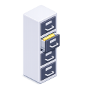

# 🎮 Metro Royale Guide

An application that helps players understand PUBGM Metro Royale through interactive maps and detailed spawn location insights.

## 🚀 Core Features
- **🗺️ Metro Royale Maps**: Arctic Base, Misty Port, Old Blockade Zone, Frontline Confrontation
- **📱 Map Modes**: Basic, Advanced, Radiation
- **🎯 Interactive Spawn Markers**: Squad spawns, solo spawns, special crates, supply crates, weapon crates, file cabinets, password doors, laptops, boss, shops, tank, zombie labs
- **📍 Coordinate System**: Tap-to-get map coordinates (crosshair mode)
- **🖼️ High-Res Zoom**: Double-tap & pinch-to-zoom preview images (16:9)
- **📥 Dynamic Assets**: Download AreaViews on-demand

## 🎨 UI/UX Highlights
- Custom PUBG-Metro style fonts
- Material 3 Dark Theme
- PUBG-style color-coded markers
- Smooth Map InteractiveViewer (zoom 0.5x-4x)
- Bottom sheets with dual Area image previews
- spawn type counters

## 📦 Installation

📱 **Android**: Download from the Google Play Store 

#### 🐧 Linux

Linux builds are available in two formats. Choose the one that suits you best.
Release version: <a href="https://github.com/nithish-gajula/MetroRoyaleGuide/releases/tag/v2.6.0">v2.6.0</a>

###### Linux AppImage Setup

1. Download `Metro_Royale_Guide-Linux-x86_64.AppImage` from the <a href="https://github.com/nithish-gajula/MetroRoyaleGuide/releases/tag/v2.6.0">releases</a>
2. Make the AppImage executable: `chmod +x Metro_Royale_Guide-Linux-x86_64.AppImage`
3. Run the app: `./Metro_Royale_Guide-Linux-x86_64.AppImage`

###### Linux tar.gz Archive Setup

1. Download `MetroRoyaleGuide-Linux-x64.tar.gz` from the <a href="https://github.com/nithish-gajula/MetroRoyaleGuide/releases/tag/v2.6.0">releases</a>
2. Untar the file `tar -xvzf MetroRoyaleGuide-Linux-x64.tar.gz`
3. Make the binary executable (if not) `chmod +x bundle/guide_for_pubg_metro_royale`
4. Run `./bundle/guide_for_pubg_metro_royale`

#### 🖥️ Windows

Windows builds are coming soon 🚧
They will be published in the <a href="https://github.com/nithish-gajula/MetroRoyaleGuide/releases/tag/v2.6.0">releases</a> section once available.

## 🚉 Metro Royale Guide – Static Assets

This repository contains **static assets** used by the <a href="https://github.com/nithish-gajula/MetroRoyaleGuide">metro royale guide</a> application, including **spawn icons** and **map images**.

> [!IMPORTANT]
> These assets are intended for **informational and guide purposes only**.  
> This is a **fan-made project** and is not affiliated with or endorsed by the official game developers.

### ⚜️ Spawn Icons

The app supports multiple **spawn types**, each represented by a dedicated icon.  
These icons are used across **Filter Chips** and **Spawn Markers** in the app UI.

### 💢 Spawn Types

1. **Supply Crates**  
   - Normal  
       
   - Rich  
     

2. **Weapon Crates**  
   

3. **File Cabinets**  
   

4. **Special Crates**  
   

5. **Password Doors**  
   

6. **Zombie Labs**  
   

7. **Shops**  
   

8. **Laptops**  
   

9. **Bosses**  
   

10. **Solo Spawns**  
    - Normal  
        
    - Rich  
      

11. **Squad Spawns**  
    - Normal  
        
    - Rich  
      

### 📐 Spawn Icon Specifications

- **Dimensions:** 128 × 128 px  
- **Format:** PNG  
- **Average Size:** ~50 KB  

## 🗺️ Maps

The Metro Royale mode includes **6 playable maps**, each supporting one or more game modes.

### 🧭 Available Maps & Modes

1. **Frontline Confrontation**  
   - Basic

2. **Old Blockade Zone**  
   - Basic  
   - Advanced  
   - Radiation

3. **Misty Port**  
   - Basic  
   - Advanced  
   - Radiation

4. **Arctic Base**  
   - Basic  
   - Advanced  
   - Radiation

5. **Zombie Uprising 2.0**  
   - Advanced

6. **Survival Drop**  
   - Advanced

## 📏 Map Asset Specifications

#### Mini Maps
- **Dimensions:** 512 × 512 px *(currently unclassified)*  
- **Format:** JPG / JPEG  
- **File Size:** < 1 MB  

#### Large Maps
- **Dimensions:** 1024 × 1024 px  
- **Format:** JPG / JPEG  
- **File Size:** < 2 MB  

## 📌 Notes

- Assets are optimized for **performance and clarity** on mobile devices  
- Map images are designed for **interactive overlays and zooming**
- File sizes are kept minimal to reduce memory usage

## 📝 License

Copyright © 2026 **Nithish Gajula**. All rights reserved.  

This software and its source code are **proprietary** and **confidential**.  
Unauthorized copying, modification, distribution, or use of this software, via any medium, is strictly prohibited.
Reverse engineering, decompiling, or disassembling the software is prohibited to the maximum extent permitted by law.

## 🤝 Support & Connect

  

Built with ❤️ by [Nithish Gajula](https://github.com/nithish-gajula) — 🎮 for **Metro Royale** fans.

**⭐ Star the repository if you find it useful!**

